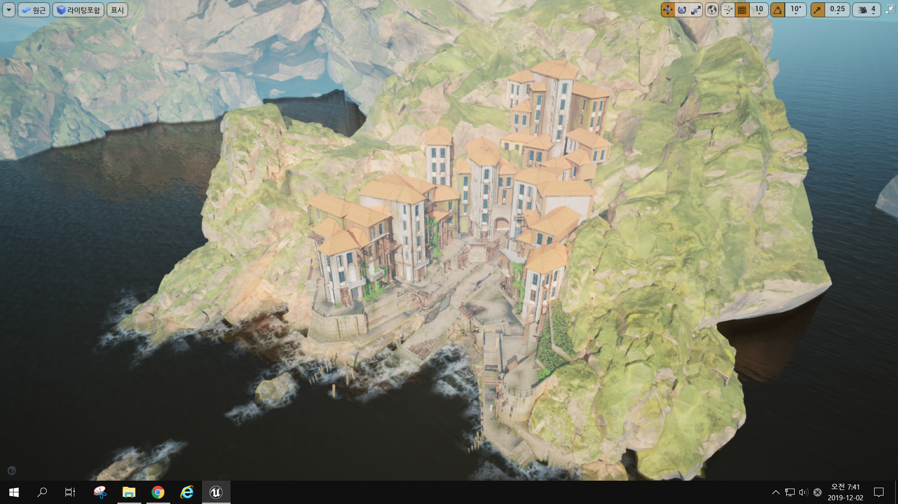

## 프로젝트 개요

* **프로젝트명:** 언리얼 Dedicated server with 스팀 연동
* **제작기간:** 약 2달 
* **플랫폼:** PC
* **언어:** C++
* **장르:** 언리얼 3D 전투 게임
* **사용 프로그램:** Unreal engine, Steam 플랫폼, Dedicated server

## 프로젝트 설명 

언리얼 자체 Dedicated server을 사용하여 스팀 플랫폼의 커뮤니티 기능을 연동  

동영상 시연 영상: https://www.youtube.com/watch?v=fx6VvYN0qYI&ab_channel=JanghoNa 

## 구현기능
- Unreal Dedicated 서버 연동
- 스팀 플랫폼 연동
- 실제 스팀 계정사용 가능
- 스팀 커뮤니티 서비스 창 사용 가능

## 아쉬운점 및 한계점
서버를 처음 개발하기전 사전 조사를 한다는 생각으로 Unreal Engine의
자체 Dedicated server를 사용해 연동을 해보았음.
기존 대형 게임 플랫폼 서비스인 Steam과 연동이 가능하다는 점에서 놀라웠음.
